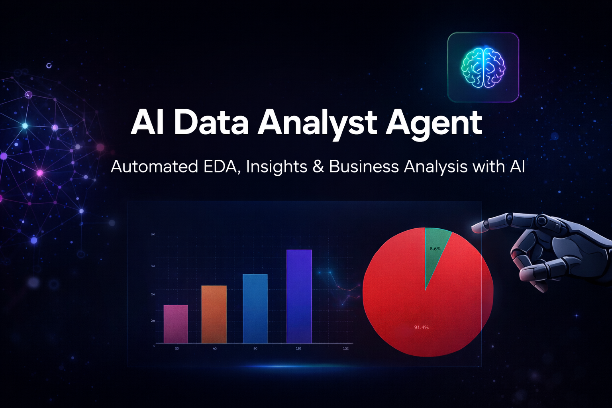

# 🤖 AI Data Analyst Agent

> Automated data analysis pipeline powered by AI  
> Run once, get full insights — EDA, statistics, visualizations, and business recommendations.

---

## 🌐 Live Demo

👉 **Try the app here:**  
https://ai-data-analyst-agent-md8e7tomwp2t4kvjmjw9ss.streamlit.app/

---

## 🎯 Business Problem

Data analysts spend **60–80% of their time** on repetitive exploratory tasks:
- cleaning datasets  
- generating basic statistics  
- building initial charts  
- identifying patterns manually  

This creates a bottleneck between **data availability and decision-making**.

---

## 💡 Solution

This AI Agent automates the entire exploratory phase, transforming raw datasets into:

- structured statistical analysis  
- professional visualizations  
- AI-generated business insights  
- ready-to-use reports  

⚡ All in under **60 seconds**

---

## ⚡ What It Does Automatically

| Step | Output |
|------|--------|
| Data Loading | Detects types, cleans nulls, parses dates |
| Statistical EDA | Descriptive stats, skewness, kurtosis |
| Correlation Analysis | Top variable relationships |
| Outlier Detection | IQR-based anomaly flagging |
| Visualizations | 4 professional charts saved to /visuals |
| AI Insights | Claude API generates executive report |
| Report Export | Markdown report saved to /reports |

---

## 🖥️ Streamlit Interface

The project also includes a **web interface** built with Streamlit, allowing users to:

- upload datasets directly  
- run automated analysis  
- visualize results instantly  
- access insights without coding  

This demonstrates the transition from **data script → data product**.

---

## 📊 Sample Output
