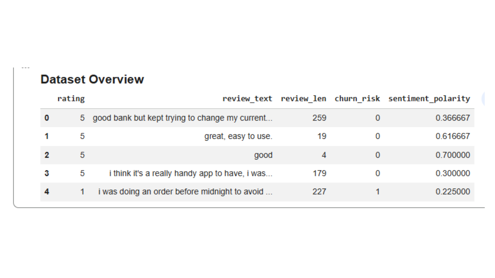
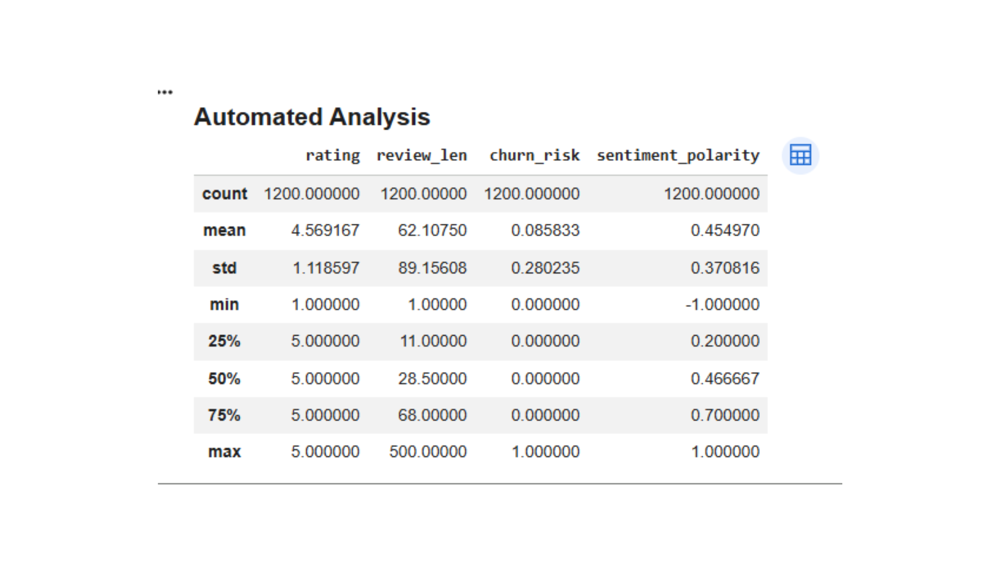
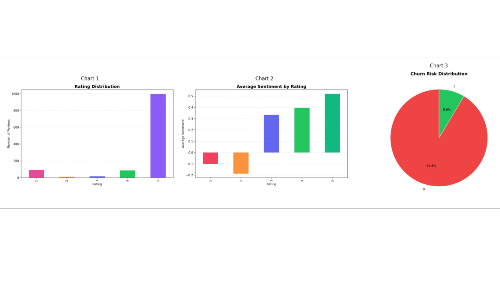

# 🤖 AI Data Analyst Agent

> Automated data analysis pipeline powered by AI  
> Run once, get full insights — EDA, statistics, visualizations, and business recommendations.

---

## 🌐 Live Demo

👉 https://ai-data-analyst-agent-md8e7tomwp2t4kvjmjw9ss.streamlit.app/

---

## 🎯 Business Problem

Data analysts spend 60–80% of their time on repetitive tasks like:
- cleaning data
- creating charts
- running basic analysis

This delays decision-making.

---

## 💡 Solution

This AI Agent automates everything and delivers:
- statistical analysis  
- charts  
- AI insights  
- final report  

⚡ in less than 60 seconds

---

## ⚡ What It Does

- Loads and cleans data  
- Runs full EDA  
- Finds correlations  
- Detects outliers  
- Creates charts  
- Generates AI insights  
- Exports report  

---

## 📊 Visuals





---

## 🚀 Run Locally

```bash
pip install -r requirements.txt
streamlit run app.py
